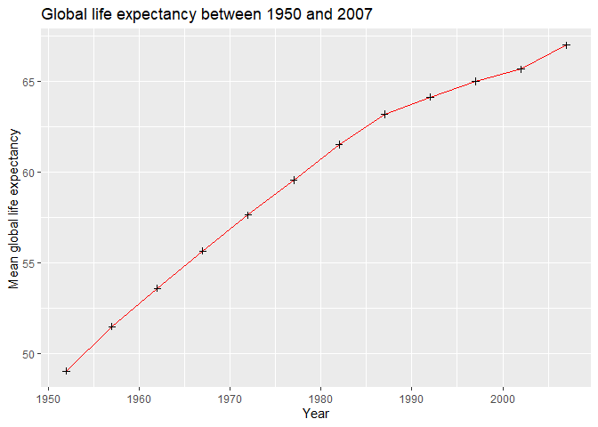
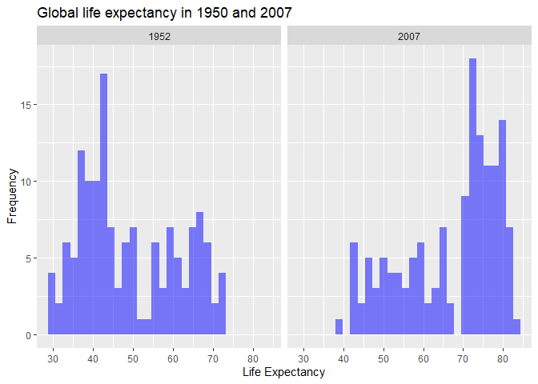
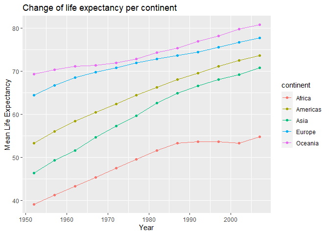
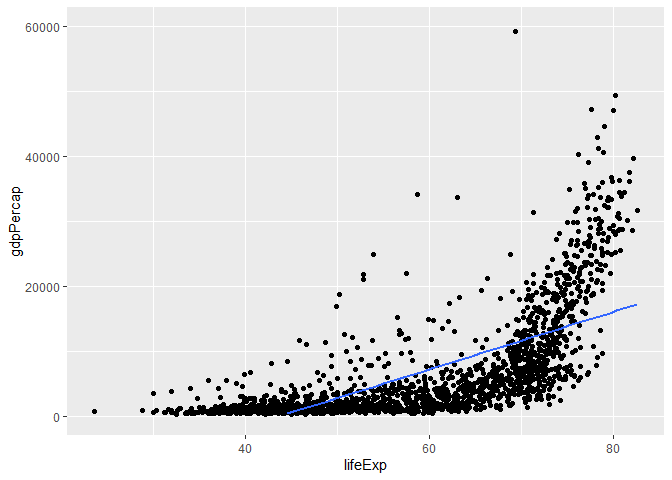
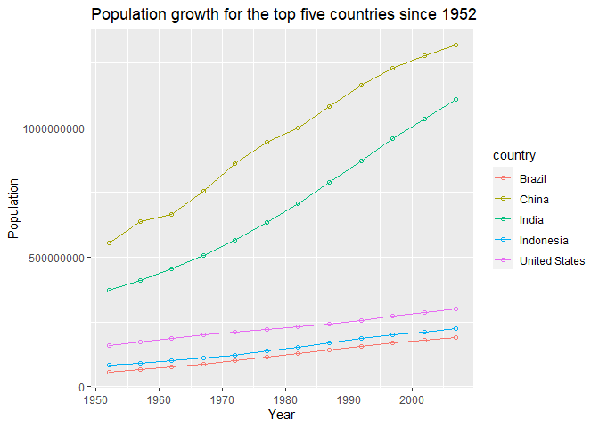
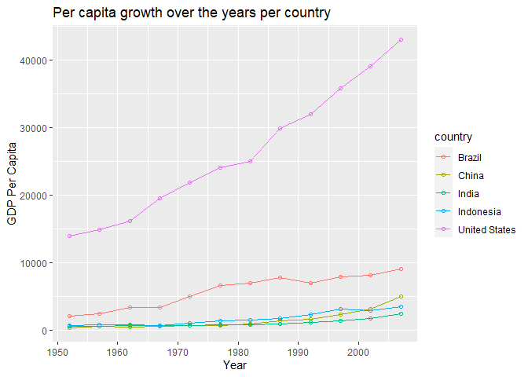
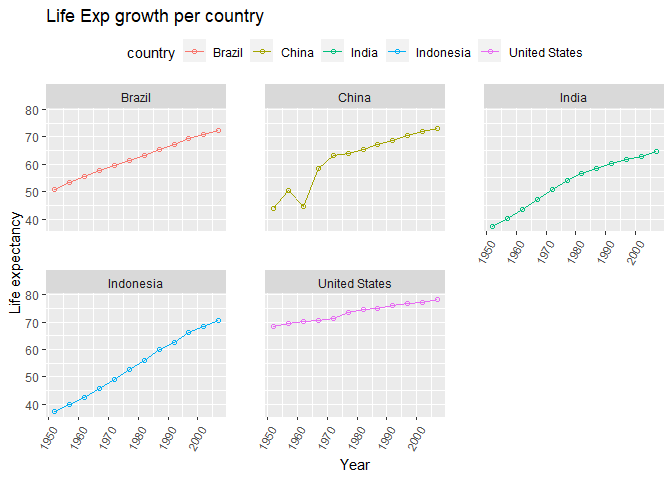

## Instructions
Answer the following questions and complete the exercises in RMarkdown. Please embed all of your code and push your final work to your repository. Your final lab report should be organized, clean, and run free from errors. Remember, you must remove the `#` for the included code chunks to run. Be sure to add your name to the author header above. For any included plots, make sure they are clearly labeled. You are free to use any plot type that you feel best communicates the results of your analysis.  

**In this homework, you should make use of the aesthetics you have learned. It's OK to be flashy!**

Make sure to use the formatting conventions of RMarkdown to make your report neat and clean!  

## Load the libraries

```r
library(tidyverse)
library(janitor)
library(here)
library(naniar)
```

## Resources
The idea for this assignment came from [Rebecca Barter's](http://www.rebeccabarter.com/blog/2017-11-17-ggplot2_tutorial/) ggplot tutorial so if you get stuck this is a good place to have a look.  

## Gapminder
For this assignment, we are going to use the dataset [gapminder](https://cran.r-project.org/web/packages/gapminder/index.html). Gapminder includes information about economics, population, and life expectancy from countries all over the world. You will need to install it before use. This is the same data that we will use for midterm 2 so this is good practice.

```r
#install.packages("gapminder")
library("gapminder")
```

## Questions
The questions below are open-ended and have many possible solutions. Your approach should, where appropriate, include numerical summaries and visuals. Be creative; assume you are building an analysis that you would ultimately present to an audience of stakeholders. Feel free to try out different `geoms` if they more clearly present your results.  

**1. Use the function(s) of your choice to get an idea of the overall structure of the data frame, including its dimensions, column names, variable classes, etc. As part of this, determine how NA's are treated in the data.**  

```r
glimpse(gapminder)
```

```
## Rows: 1,704
## Columns: 6
## $ country   <fct> Afghanistan, Afghanistan, Afghanistan, Afghanistan, Afgha...
## $ continent <fct> Asia, Asia, Asia, Asia, Asia, Asia, Asia, Asia, Asia, Asi...
## $ year      <int> 1952, 1957, 1962, 1967, 1972, 1977, 1982, 1987, 1992, 199...
## $ lifeExp   <dbl> 28.801, 30.332, 31.997, 34.020, 36.088, 38.438, 39.854, 4...
## $ pop       <int> 8425333, 9240934, 10267083, 11537966, 13079460, 14880372,...
## $ gdpPercap <dbl> 779.4453, 820.8530, 853.1007, 836.1971, 739.9811, 786.113...
```

```r
options(scipen=999) #cancels the use of scientific notation for the session
gapminder <- gapminder
```

**2. Among the interesting variables in gapminder is life expectancy. How has global life expectancy changed between 1952 and 2007?**


```r
gapminder %>%
  group_by(year) %>%
  summarise('mean global life expectancy' = mean(lifeExp)) %>%
  ggplot(aes(x = `year`, y = `mean global life expectancy`)) + geom_line(color = 'red') + geom_point(shape = 3) +
  labs(title = "Global life expectancy between 1950 and 2007", x = 'Year', y = 'Mean global life expectancy')
```

```
## `summarise()` ungrouping output (override with `.groups` argument)
```

<!-- -->


**3. How do the distributions of life expectancy compare for the years 1952 and 2007?**

```r
gapminder %>%
  filter(year == '1952' | year == '2007') %>%
  ggplot(aes(x = `lifeExp`)) + geom_histogram(fill = 'blue', alpha = .5) +
  labs(title = "Global life expectancy in 1950 and 2007", x = 'Life Expectancy', y = 'Frequency') + facet_wrap(~year)
```

```
## `stat_bin()` using `bins = 30`. Pick better value with `binwidth`.
```

<!-- -->

**4. Your answer above doesn't tell the whole story since life expectancy varies by region. Make a summary that shows the min, mean, and max life expectancy by continent for all years represented in the data.**


```r
gapminder %>%
  group_by(continent) %>%
  summarise(min_life_exp = min(lifeExp), max_life_exp = max(lifeExp), mean_life_exp = mean(lifeExp) )
```

```
## `summarise()` ungrouping output (override with `.groups` argument)
```

```
## # A tibble: 5 x 4
##   continent min_life_exp max_life_exp mean_life_exp
##   <fct>            <dbl>        <dbl>         <dbl>
## 1 Africa            23.6         76.4          48.9
## 2 Americas          37.6         80.7          64.7
## 3 Asia              28.8         82.6          60.1
## 4 Europe            43.6         81.8          71.9
## 5 Oceania           69.1         81.2          74.3
```


**5. How has life expectancy changed between 1952-2007 for each continent?**

```r
gapminder %>%
  group_by(year, continent) %>%
  summarise(mean_life_expectancy = mean(lifeExp)) %>%
  ggplot(aes(x = year, y = mean_life_expectancy, colour = continent)) + geom_line() + labs(title = "Change of life expectancy per continent", x = "Year", y = "Mean Life Expectancy") + geom_point()
```

```
## `summarise()` regrouping output by 'year' (override with `.groups` argument)
```

<!-- -->


**6. We are interested in the relationship between per capita GDP and life expectancy; i.e. does having more money help you live longer?**

```r
gapminder %>%
  ggplot(aes(x = lifeExp, y = gdpPercap)) + geom_line() + facet_wrap(~year)
```

<!-- -->

**7. Which countries have had the largest population growth since 1952?**


```r
gapminder %>%
  filter(year == 1952 | year == 2007) %>%
  group_by(country) %>%
  summarise(difference = max(pop) - min(pop)) %>%
  arrange(desc(difference)) %>%
  head(5)
```

```
## `summarise()` ungrouping output (override with `.groups` argument)
```

```
## # A tibble: 5 x 2
##   country       difference
##   <fct>              <int>
## 1 China          762419569
## 2 India          738396331
## 3 United States  143586947
## 4 Indonesia      141495000
## 5 Brazil         133408087
```


**8. Use your results from the question above to plot population growth for the top five countries since 1952.**


```r
gapminder %>%
  filter(country == 'China' | country == 'India' | country == 'United States' | country == 'Indonesia' | country == 'Brazil') %>%
  ggplot(aes(x = year, y = pop, colour = country)) + geom_line() + geom_point(shape = 1) + labs(title = "Population growth for the top five countries since 1952", x = "Year", y = "Population")
```

<!-- -->


**9. How does per-capita GDP growth compare between these same five countries?**

```r
gapminder %>%
  filter(country == 'China' | country == 'India' | country == 'United States' | country == 'Indonesia' | country == 'Brazil') %>%
  ggplot(aes(x = year, y = gdpPercap, colour = country)) + geom_line() + geom_point(shape = 1) + labs(title = "Per capita growth over the years per country", x = "Year", y = "GDP Per Capita")
```

<!-- -->

**10. Make one plot of your choice that uses faceting!**

```r
gapminder %>%
  filter(country == 'China' | country == 'India' | country == 'United States' | country == 'Indonesia' | country == 'Brazil') %>%
  ggplot(aes(x = year, y = lifeExp, colour = country)) + geom_line() + geom_point(shape = 1) + theme(legend.position = "top", panel.spacing = unit(2, "lines"), axis.text.x = element_text(angle = 60, hjust=1)) + facet_wrap(~country) + labs(title = "Life Exp growth per country", x = "Year", y = "Life expectancy")
```

<!-- -->

## Push your final code to GitHub!
Please be sure that you check the `keep md` file in the knit preferences. 
