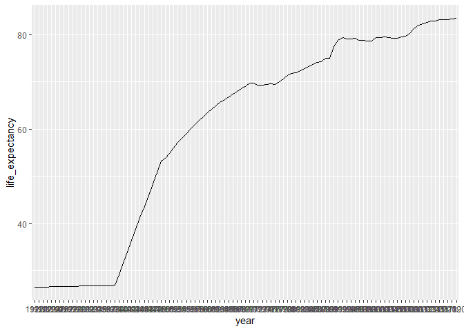
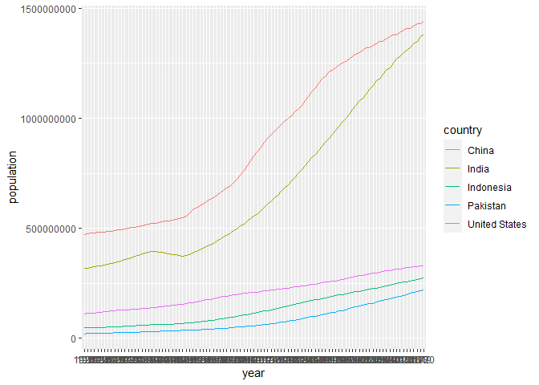
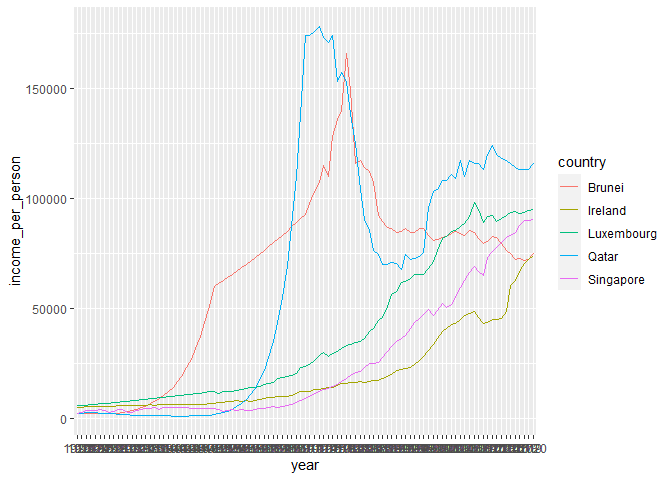
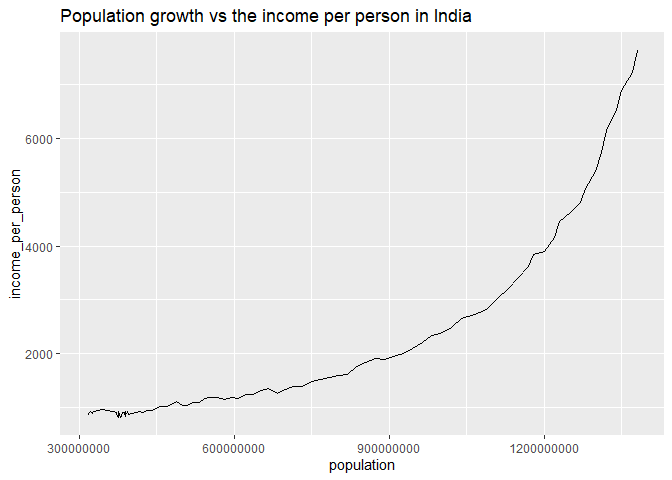

## Instructions
Answer the following questions and complete the exercises in RMarkdown. Please embed all of your code and push your final work to your repository. Your code should be organized, clean, and run free from errors. Be sure to **add your name** to the author header above. You may use any resources to answer these questions (including each other), but you may not post questions to Open Stacks or external help sites. There are 10 total questions.  

Make sure to use the formatting conventions of RMarkdown to make your report neat and clean! Your plots should use consistent aesthetics throughout. Feel free to be creative- there are many possible solutions to these questions!  

This exam is due by **12:00p on Tuesday, February 23**.  

## Load the libraries

```r
library(tidyverse)
```

```
## -- Attaching packages --------------------------------------- tidyverse 1.3.0 --
```

```
## √ ggplot2 3.3.3     √ purrr   0.3.4
## √ tibble  3.0.6     √ dplyr   1.0.4
## √ tidyr   1.1.2     √ stringr 1.4.0
## √ readr   1.4.0     √ forcats 0.5.1
```

```
## -- Conflicts ------------------------------------------ tidyverse_conflicts() --
## x dplyr::filter() masks stats::filter()
## x dplyr::lag()    masks stats::lag()
```

```r
library(janitor)
```

```
## 
## Attaching package: 'janitor'
```

```
## The following objects are masked from 'package:stats':
## 
##     chisq.test, fisher.test
```

```r
library(here)
```

```
## here() starts at D:/TA files/Winter2021 BIS15L/students_rep/BIS15W2021_snamboodiri
```

```r
options(scipen=999) #disables scientific notation when printing
```

## Gapminder
For this assignment, we are going to use data from  [gapminder](https://www.gapminder.org/). Gapminder includes information about economics, population, social issues, and life expectancy from countries all over the world. We will use three data sets, so please load all three.  

One thing to note is that the data include years beyond 2021. These are projections based on modeling done by the gapminder organization. Start by importing the data.

```r
population <- readr::read_csv("data/population_total.csv")
```

```
## 
## -- Column specification --------------------------------------------------------
## cols(
##   .default = col_double(),
##   country = col_character()
## )
## i Use `spec()` for the full column specifications.
```

```r
population
```

```
## # A tibble: 195 x 302
##    country `1800` `1801` `1802` `1803` `1804` `1805` `1806` `1807` `1808` `1809`
##    <chr>    <dbl>  <dbl>  <dbl>  <dbl>  <dbl>  <dbl>  <dbl>  <dbl>  <dbl>  <dbl>
##  1 Afghan~ 3.28e6 3.28e6 3.28e6 3.28e6 3.28e6 3.28e6 3.28e6 3.28e6 3.28e6 3.28e6
##  2 Albania 4.00e5 4.02e5 4.04e5 4.05e5 4.07e5 4.09e5 4.11e5 4.13e5 4.14e5 4.16e5
##  3 Algeria 2.50e6 2.51e6 2.52e6 2.53e6 2.54e6 2.55e6 2.56e6 2.56e6 2.57e6 2.58e6
##  4 Andorra 2.65e3 2.65e3 2.65e3 2.65e3 2.65e3 2.65e3 2.65e3 2.65e3 2.65e3 2.65e3
##  5 Angola  1.57e6 1.57e6 1.57e6 1.57e6 1.57e6 1.57e6 1.57e6 1.57e6 1.57e6 1.57e6
##  6 Antigu~ 3.70e4 3.70e4 3.70e4 3.70e4 3.70e4 3.70e4 3.70e4 3.70e4 3.70e4 3.70e4
##  7 Argent~ 5.34e5 5.20e5 5.06e5 4.92e5 4.79e5 4.66e5 4.53e5 4.41e5 4.29e5 4.17e5
##  8 Armenia 4.13e5 4.13e5 4.13e5 4.13e5 4.13e5 4.13e5 4.13e5 4.13e5 4.13e5 4.13e5
##  9 Austra~ 2.00e5 2.05e5 2.11e5 2.16e5 2.22e5 2.27e5 2.33e5 2.39e5 2.46e5 2.52e5
## 10 Austria 3.00e6 3.02e6 3.04e6 3.05e6 3.07e6 3.09e6 3.11e6 3.12e6 3.14e6 3.16e6
## # ... with 185 more rows, and 291 more variables: 1810 <dbl>, 1811 <dbl>,
## #   1812 <dbl>, 1813 <dbl>, 1814 <dbl>, 1815 <dbl>, 1816 <dbl>, 1817 <dbl>,
## #   1818 <dbl>, 1819 <dbl>, 1820 <dbl>, 1821 <dbl>, 1822 <dbl>, 1823 <dbl>,
## #   1824 <dbl>, 1825 <dbl>, 1826 <dbl>, 1827 <dbl>, 1828 <dbl>, 1829 <dbl>,
## #   1830 <dbl>, 1831 <dbl>, 1832 <dbl>, 1833 <dbl>, 1834 <dbl>, 1835 <dbl>,
## #   1836 <dbl>, 1837 <dbl>, 1838 <dbl>, 1839 <dbl>, 1840 <dbl>, 1841 <dbl>,
## #   1842 <dbl>, 1843 <dbl>, 1844 <dbl>, 1845 <dbl>, 1846 <dbl>, 1847 <dbl>,
## #   1848 <dbl>, 1849 <dbl>, 1850 <dbl>, 1851 <dbl>, 1852 <dbl>, 1853 <dbl>,
## #   1854 <dbl>, 1855 <dbl>, 1856 <dbl>, 1857 <dbl>, 1858 <dbl>, 1859 <dbl>,
## #   1860 <dbl>, 1861 <dbl>, 1862 <dbl>, 1863 <dbl>, 1864 <dbl>, 1865 <dbl>,
## #   1866 <dbl>, 1867 <dbl>, 1868 <dbl>, 1869 <dbl>, 1870 <dbl>, 1871 <dbl>,
## #   1872 <dbl>, 1873 <dbl>, 1874 <dbl>, 1875 <dbl>, 1876 <dbl>, 1877 <dbl>,
## #   1878 <dbl>, 1879 <dbl>, 1880 <dbl>, 1881 <dbl>, 1882 <dbl>, 1883 <dbl>,
## #   1884 <dbl>, 1885 <dbl>, 1886 <dbl>, 1887 <dbl>, 1888 <dbl>, 1889 <dbl>,
## #   1890 <dbl>, 1891 <dbl>, 1892 <dbl>, 1893 <dbl>, 1894 <dbl>, 1895 <dbl>,
## #   1896 <dbl>, 1897 <dbl>, 1898 <dbl>, 1899 <dbl>, 1900 <dbl>, 1901 <dbl>,
## #   1902 <dbl>, 1903 <dbl>, 1904 <dbl>, 1905 <dbl>, 1906 <dbl>, 1907 <dbl>,
## #   1908 <dbl>, 1909 <dbl>, ...
```


```r
income <- readr:: read_csv("data/income_per_person_gdppercapita_ppp_inflation_adjusted.csv")
```

```
## 
## -- Column specification --------------------------------------------------------
## cols(
##   .default = col_double(),
##   country = col_character()
## )
## i Use `spec()` for the full column specifications.
```

```r
income
```

```
## # A tibble: 193 x 242
##    country `1800` `1801` `1802` `1803` `1804` `1805` `1806` `1807` `1808` `1809`
##    <chr>    <dbl>  <dbl>  <dbl>  <dbl>  <dbl>  <dbl>  <dbl>  <dbl>  <dbl>  <dbl>
##  1 Afghan~    603    603    603    603    603    603    603    603    603    603
##  2 Albania    667    667    667    667    667    668    668    668    668    668
##  3 Algeria    715    716    717    718    719    720    721    722    723    724
##  4 Andorra   1200   1200   1200   1200   1210   1210   1210   1210   1220   1220
##  5 Angola     618    620    623    626    628    631    634    637    640    642
##  6 Antigu~    757    757    757    757    757    757    757    758    758    758
##  7 Argent~   1640   1640   1650   1650   1660   1660   1670   1680   1680   1690
##  8 Armenia    514    514    514    514    514    514    514    514    514    514
##  9 Austra~    817    822    826    831    836    841    845    850    855    860
## 10 Austria   1850   1850   1860   1870   1880   1880   1890   1900   1910   1920
## # ... with 183 more rows, and 231 more variables: 1810 <dbl>, 1811 <dbl>,
## #   1812 <dbl>, 1813 <dbl>, 1814 <dbl>, 1815 <dbl>, 1816 <dbl>, 1817 <dbl>,
## #   1818 <dbl>, 1819 <dbl>, 1820 <dbl>, 1821 <dbl>, 1822 <dbl>, 1823 <dbl>,
## #   1824 <dbl>, 1825 <dbl>, 1826 <dbl>, 1827 <dbl>, 1828 <dbl>, 1829 <dbl>,
## #   1830 <dbl>, 1831 <dbl>, 1832 <dbl>, 1833 <dbl>, 1834 <dbl>, 1835 <dbl>,
## #   1836 <dbl>, 1837 <dbl>, 1838 <dbl>, 1839 <dbl>, 1840 <dbl>, 1841 <dbl>,
## #   1842 <dbl>, 1843 <dbl>, 1844 <dbl>, 1845 <dbl>, 1846 <dbl>, 1847 <dbl>,
## #   1848 <dbl>, 1849 <dbl>, 1850 <dbl>, 1851 <dbl>, 1852 <dbl>, 1853 <dbl>,
## #   1854 <dbl>, 1855 <dbl>, 1856 <dbl>, 1857 <dbl>, 1858 <dbl>, 1859 <dbl>,
## #   1860 <dbl>, 1861 <dbl>, 1862 <dbl>, 1863 <dbl>, 1864 <dbl>, 1865 <dbl>,
## #   1866 <dbl>, 1867 <dbl>, 1868 <dbl>, 1869 <dbl>, 1870 <dbl>, 1871 <dbl>,
## #   1872 <dbl>, 1873 <dbl>, 1874 <dbl>, 1875 <dbl>, 1876 <dbl>, 1877 <dbl>,
## #   1878 <dbl>, 1879 <dbl>, 1880 <dbl>, 1881 <dbl>, 1882 <dbl>, 1883 <dbl>,
## #   1884 <dbl>, 1885 <dbl>, 1886 <dbl>, 1887 <dbl>, 1888 <dbl>, 1889 <dbl>,
## #   1890 <dbl>, 1891 <dbl>, 1892 <dbl>, 1893 <dbl>, 1894 <dbl>, 1895 <dbl>,
## #   1896 <dbl>, 1897 <dbl>, 1898 <dbl>, 1899 <dbl>, 1900 <dbl>, 1901 <dbl>,
## #   1902 <dbl>, 1903 <dbl>, 1904 <dbl>, 1905 <dbl>, 1906 <dbl>, 1907 <dbl>,
## #   1908 <dbl>, 1909 <dbl>, ...
```


```r
life_expectancy <- readr:: read_csv("data/life_expectancy_years.csv")
```

```
## 
## -- Column specification --------------------------------------------------------
## cols(
##   .default = col_double(),
##   country = col_character()
## )
## i Use `spec()` for the full column specifications.
```

```r
life_expectancy
```

```
## # A tibble: 187 x 302
##    country `1800` `1801` `1802` `1803` `1804` `1805` `1806` `1807` `1808` `1809`
##    <chr>    <dbl>  <dbl>  <dbl>  <dbl>  <dbl>  <dbl>  <dbl>  <dbl>  <dbl>  <dbl>
##  1 Afghan~   28.2   28.2   28.2   28.2   28.2   28.2   28.1   28.1   28.1   28.1
##  2 Albania   35.4   35.4   35.4   35.4   35.4   35.4   35.4   35.4   35.4   35.4
##  3 Algeria   28.8   28.8   28.8   28.8   28.8   28.8   28.8   28.8   28.8   28.8
##  4 Andorra   NA     NA     NA     NA     NA     NA     NA     NA     NA     NA  
##  5 Angola    27     27     27     27     27     27     27     27     27     27  
##  6 Antigu~   33.5   33.5   33.5   33.5   33.5   33.5   33.5   33.5   33.5   33.5
##  7 Argent~   33.2   33.2   33.2   33.2   33.2   33.2   33.2   33.2   33.2   33.2
##  8 Armenia   34     34     34     34     34     34     34     34     34     34  
##  9 Austra~   34     34     34     34     34     34     34     34     34     34  
## 10 Austria   34.4   34.4   34.4   34.4   34.4   34.4   34.4   34.4   34.4   34.4
## # ... with 177 more rows, and 291 more variables: 1810 <dbl>, 1811 <dbl>,
## #   1812 <dbl>, 1813 <dbl>, 1814 <dbl>, 1815 <dbl>, 1816 <dbl>, 1817 <dbl>,
## #   1818 <dbl>, 1819 <dbl>, 1820 <dbl>, 1821 <dbl>, 1822 <dbl>, 1823 <dbl>,
## #   1824 <dbl>, 1825 <dbl>, 1826 <dbl>, 1827 <dbl>, 1828 <dbl>, 1829 <dbl>,
## #   1830 <dbl>, 1831 <dbl>, 1832 <dbl>, 1833 <dbl>, 1834 <dbl>, 1835 <dbl>,
## #   1836 <dbl>, 1837 <dbl>, 1838 <dbl>, 1839 <dbl>, 1840 <dbl>, 1841 <dbl>,
## #   1842 <dbl>, 1843 <dbl>, 1844 <dbl>, 1845 <dbl>, 1846 <dbl>, 1847 <dbl>,
## #   1848 <dbl>, 1849 <dbl>, 1850 <dbl>, 1851 <dbl>, 1852 <dbl>, 1853 <dbl>,
## #   1854 <dbl>, 1855 <dbl>, 1856 <dbl>, 1857 <dbl>, 1858 <dbl>, 1859 <dbl>,
## #   1860 <dbl>, 1861 <dbl>, 1862 <dbl>, 1863 <dbl>, 1864 <dbl>, 1865 <dbl>,
## #   1866 <dbl>, 1867 <dbl>, 1868 <dbl>, 1869 <dbl>, 1870 <dbl>, 1871 <dbl>,
## #   1872 <dbl>, 1873 <dbl>, 1874 <dbl>, 1875 <dbl>, 1876 <dbl>, 1877 <dbl>,
## #   1878 <dbl>, 1879 <dbl>, 1880 <dbl>, 1881 <dbl>, 1882 <dbl>, 1883 <dbl>,
## #   1884 <dbl>, 1885 <dbl>, 1886 <dbl>, 1887 <dbl>, 1888 <dbl>, 1889 <dbl>,
## #   1890 <dbl>, 1891 <dbl>, 1892 <dbl>, 1893 <dbl>, 1894 <dbl>, 1895 <dbl>,
## #   1896 <dbl>, 1897 <dbl>, 1898 <dbl>, 1899 <dbl>, 1900 <dbl>, 1901 <dbl>,
## #   1902 <dbl>, 1903 <dbl>, 1904 <dbl>, 1905 <dbl>, 1906 <dbl>, 1907 <dbl>,
## #   1908 <dbl>, 1909 <dbl>, ...
```

1. (3 points) Once you have an idea of the structure of the data, please make each data set tidy and store them as new objects. You will need both the original and tidy data!

```r
population_long <- population %>%
    pivot_longer(-country, #country does not pivot
               names_to = "year", 
               values_to = "population"
               )

population_long
```

```
## # A tibble: 58,695 x 3
##    country     year  population
##    <chr>       <chr>      <dbl>
##  1 Afghanistan 1800     3280000
##  2 Afghanistan 1801     3280000
##  3 Afghanistan 1802     3280000
##  4 Afghanistan 1803     3280000
##  5 Afghanistan 1804     3280000
##  6 Afghanistan 1805     3280000
##  7 Afghanistan 1806     3280000
##  8 Afghanistan 1807     3280000
##  9 Afghanistan 1808     3280000
## 10 Afghanistan 1809     3280000
## # ... with 58,685 more rows
```


```r
income_long <- income %>%
    pivot_longer(-country, #country does not pivot
               names_to = "year", 
               values_to = "income_per_person"
               )

income_long
```

```
## # A tibble: 46,513 x 3
##    country     year  income_per_person
##    <chr>       <chr>             <dbl>
##  1 Afghanistan 1800                603
##  2 Afghanistan 1801                603
##  3 Afghanistan 1802                603
##  4 Afghanistan 1803                603
##  5 Afghanistan 1804                603
##  6 Afghanistan 1805                603
##  7 Afghanistan 1806                603
##  8 Afghanistan 1807                603
##  9 Afghanistan 1808                603
## 10 Afghanistan 1809                603
## # ... with 46,503 more rows
```


```r
life_expectancy_long <- life_expectancy %>%
    pivot_longer(-country, #country does not pivot
               names_to = "year", 
               values_to = "life_expectancy"
               )

life_expectancy_long
```

```
## # A tibble: 56,287 x 3
##    country     year  life_expectancy
##    <chr>       <chr>           <dbl>
##  1 Afghanistan 1800             28.2
##  2 Afghanistan 1801             28.2
##  3 Afghanistan 1802             28.2
##  4 Afghanistan 1803             28.2
##  5 Afghanistan 1804             28.2
##  6 Afghanistan 1805             28.2
##  7 Afghanistan 1806             28.1
##  8 Afghanistan 1807             28.1
##  9 Afghanistan 1808             28.1
## 10 Afghanistan 1809             28.1
## # ... with 56,277 more rows
```

2. (1 point) How many different countries are represented in the data? Provide the total number and their names. Since each data set includes different numbers of countries, you will need to do this for each one.

```r
n_distinct(population)
```

```
## [1] 195
```

```r
population %>%
  tabyl(country)
```

```
##                         country n     percent
##                     Afghanistan 1 0.005128205
##                         Albania 1 0.005128205
##                         Algeria 1 0.005128205
##                         Andorra 1 0.005128205
##                          Angola 1 0.005128205
##             Antigua and Barbuda 1 0.005128205
##                       Argentina 1 0.005128205
##                         Armenia 1 0.005128205
##                       Australia 1 0.005128205
##                         Austria 1 0.005128205
##                      Azerbaijan 1 0.005128205
##                         Bahamas 1 0.005128205
##                         Bahrain 1 0.005128205
##                      Bangladesh 1 0.005128205
##                        Barbados 1 0.005128205
##                         Belarus 1 0.005128205
##                         Belgium 1 0.005128205
##                          Belize 1 0.005128205
##                           Benin 1 0.005128205
##                          Bhutan 1 0.005128205
##                         Bolivia 1 0.005128205
##          Bosnia and Herzegovina 1 0.005128205
##                        Botswana 1 0.005128205
##                          Brazil 1 0.005128205
##                          Brunei 1 0.005128205
##                        Bulgaria 1 0.005128205
##                    Burkina Faso 1 0.005128205
##                         Burundi 1 0.005128205
##                        Cambodia 1 0.005128205
##                        Cameroon 1 0.005128205
##                          Canada 1 0.005128205
##                      Cape Verde 1 0.005128205
##        Central African Republic 1 0.005128205
##                            Chad 1 0.005128205
##                           Chile 1 0.005128205
##                           China 1 0.005128205
##                        Colombia 1 0.005128205
##                         Comoros 1 0.005128205
##                Congo, Dem. Rep. 1 0.005128205
##                     Congo, Rep. 1 0.005128205
##                      Costa Rica 1 0.005128205
##                   Cote d'Ivoire 1 0.005128205
##                         Croatia 1 0.005128205
##                            Cuba 1 0.005128205
##                          Cyprus 1 0.005128205
##                  Czech Republic 1 0.005128205
##                         Denmark 1 0.005128205
##                        Djibouti 1 0.005128205
##                        Dominica 1 0.005128205
##              Dominican Republic 1 0.005128205
##                         Ecuador 1 0.005128205
##                           Egypt 1 0.005128205
##                     El Salvador 1 0.005128205
##               Equatorial Guinea 1 0.005128205
##                         Eritrea 1 0.005128205
##                         Estonia 1 0.005128205
##                        Eswatini 1 0.005128205
##                        Ethiopia 1 0.005128205
##                            Fiji 1 0.005128205
##                         Finland 1 0.005128205
##                          France 1 0.005128205
##                           Gabon 1 0.005128205
##                          Gambia 1 0.005128205
##                         Georgia 1 0.005128205
##                         Germany 1 0.005128205
##                           Ghana 1 0.005128205
##                          Greece 1 0.005128205
##                         Grenada 1 0.005128205
##                       Guatemala 1 0.005128205
##                          Guinea 1 0.005128205
##                   Guinea-Bissau 1 0.005128205
##                          Guyana 1 0.005128205
##                           Haiti 1 0.005128205
##                        Holy See 1 0.005128205
##                        Honduras 1 0.005128205
##                         Hungary 1 0.005128205
##                         Iceland 1 0.005128205
##                           India 1 0.005128205
##                       Indonesia 1 0.005128205
##                            Iran 1 0.005128205
##                            Iraq 1 0.005128205
##                         Ireland 1 0.005128205
##                          Israel 1 0.005128205
##                           Italy 1 0.005128205
##                         Jamaica 1 0.005128205
##                           Japan 1 0.005128205
##                          Jordan 1 0.005128205
##                      Kazakhstan 1 0.005128205
##                           Kenya 1 0.005128205
##                        Kiribati 1 0.005128205
##                          Kuwait 1 0.005128205
##                 Kyrgyz Republic 1 0.005128205
##                             Lao 1 0.005128205
##                          Latvia 1 0.005128205
##                         Lebanon 1 0.005128205
##                         Lesotho 1 0.005128205
##                         Liberia 1 0.005128205
##                           Libya 1 0.005128205
##                   Liechtenstein 1 0.005128205
##                       Lithuania 1 0.005128205
##                      Luxembourg 1 0.005128205
##                      Madagascar 1 0.005128205
##                          Malawi 1 0.005128205
##                        Malaysia 1 0.005128205
##                        Maldives 1 0.005128205
##                            Mali 1 0.005128205
##                           Malta 1 0.005128205
##                Marshall Islands 1 0.005128205
##                      Mauritania 1 0.005128205
##                       Mauritius 1 0.005128205
##                          Mexico 1 0.005128205
##           Micronesia, Fed. Sts. 1 0.005128205
##                         Moldova 1 0.005128205
##                          Monaco 1 0.005128205
##                        Mongolia 1 0.005128205
##                      Montenegro 1 0.005128205
##                         Morocco 1 0.005128205
##                      Mozambique 1 0.005128205
##                         Myanmar 1 0.005128205
##                         Namibia 1 0.005128205
##                           Nauru 1 0.005128205
##                           Nepal 1 0.005128205
##                     Netherlands 1 0.005128205
##                     New Zealand 1 0.005128205
##                       Nicaragua 1 0.005128205
##                           Niger 1 0.005128205
##                         Nigeria 1 0.005128205
##                     North Korea 1 0.005128205
##                 North Macedonia 1 0.005128205
##                          Norway 1 0.005128205
##                            Oman 1 0.005128205
##                        Pakistan 1 0.005128205
##                           Palau 1 0.005128205
##                       Palestine 1 0.005128205
##                          Panama 1 0.005128205
##                Papua New Guinea 1 0.005128205
##                        Paraguay 1 0.005128205
##                            Peru 1 0.005128205
##                     Philippines 1 0.005128205
##                          Poland 1 0.005128205
##                        Portugal 1 0.005128205
##                           Qatar 1 0.005128205
##                         Romania 1 0.005128205
##                          Russia 1 0.005128205
##                          Rwanda 1 0.005128205
##                           Samoa 1 0.005128205
##                      San Marino 1 0.005128205
##           Sao Tome and Principe 1 0.005128205
##                    Saudi Arabia 1 0.005128205
##                         Senegal 1 0.005128205
##                          Serbia 1 0.005128205
##                      Seychelles 1 0.005128205
##                    Sierra Leone 1 0.005128205
##                       Singapore 1 0.005128205
##                 Slovak Republic 1 0.005128205
##                        Slovenia 1 0.005128205
##                 Solomon Islands 1 0.005128205
##                         Somalia 1 0.005128205
##                    South Africa 1 0.005128205
##                     South Korea 1 0.005128205
##                     South Sudan 1 0.005128205
##                           Spain 1 0.005128205
##                       Sri Lanka 1 0.005128205
##             St. Kitts and Nevis 1 0.005128205
##                       St. Lucia 1 0.005128205
##  St. Vincent and the Grenadines 1 0.005128205
##                           Sudan 1 0.005128205
##                        Suriname 1 0.005128205
##                          Sweden 1 0.005128205
##                     Switzerland 1 0.005128205
##                           Syria 1 0.005128205
##                      Tajikistan 1 0.005128205
##                        Tanzania 1 0.005128205
##                        Thailand 1 0.005128205
##                     Timor-Leste 1 0.005128205
##                            Togo 1 0.005128205
##                           Tonga 1 0.005128205
##             Trinidad and Tobago 1 0.005128205
##                         Tunisia 1 0.005128205
##                          Turkey 1 0.005128205
##                    Turkmenistan 1 0.005128205
##                          Tuvalu 1 0.005128205
##                          Uganda 1 0.005128205
##                         Ukraine 1 0.005128205
##            United Arab Emirates 1 0.005128205
##                  United Kingdom 1 0.005128205
##                   United States 1 0.005128205
##                         Uruguay 1 0.005128205
##                      Uzbekistan 1 0.005128205
##                         Vanuatu 1 0.005128205
##                       Venezuela 1 0.005128205
##                         Vietnam 1 0.005128205
##                           Yemen 1 0.005128205
##                          Zambia 1 0.005128205
##                        Zimbabwe 1 0.005128205
```


```r
n_distinct(income)
```

```
## [1] 193
```

```r
income %>%
  tabyl(country)
```

```
##                         country n     percent
##                     Afghanistan 1 0.005181347
##                         Albania 1 0.005181347
##                         Algeria 1 0.005181347
##                         Andorra 1 0.005181347
##                          Angola 1 0.005181347
##             Antigua and Barbuda 1 0.005181347
##                       Argentina 1 0.005181347
##                         Armenia 1 0.005181347
##                       Australia 1 0.005181347
##                         Austria 1 0.005181347
##                      Azerbaijan 1 0.005181347
##                         Bahamas 1 0.005181347
##                         Bahrain 1 0.005181347
##                      Bangladesh 1 0.005181347
##                        Barbados 1 0.005181347
##                         Belarus 1 0.005181347
##                         Belgium 1 0.005181347
##                          Belize 1 0.005181347
##                           Benin 1 0.005181347
##                          Bhutan 1 0.005181347
##                         Bolivia 1 0.005181347
##          Bosnia and Herzegovina 1 0.005181347
##                        Botswana 1 0.005181347
##                          Brazil 1 0.005181347
##                          Brunei 1 0.005181347
##                        Bulgaria 1 0.005181347
##                    Burkina Faso 1 0.005181347
##                         Burundi 1 0.005181347
##                        Cambodia 1 0.005181347
##                        Cameroon 1 0.005181347
##                          Canada 1 0.005181347
##                      Cape Verde 1 0.005181347
##        Central African Republic 1 0.005181347
##                            Chad 1 0.005181347
##                           Chile 1 0.005181347
##                           China 1 0.005181347
##                        Colombia 1 0.005181347
##                         Comoros 1 0.005181347
##                Congo, Dem. Rep. 1 0.005181347
##                     Congo, Rep. 1 0.005181347
##                      Costa Rica 1 0.005181347
##                   Cote d'Ivoire 1 0.005181347
##                         Croatia 1 0.005181347
##                            Cuba 1 0.005181347
##                          Cyprus 1 0.005181347
##                  Czech Republic 1 0.005181347
##                         Denmark 1 0.005181347
##                        Djibouti 1 0.005181347
##                        Dominica 1 0.005181347
##              Dominican Republic 1 0.005181347
##                         Ecuador 1 0.005181347
##                           Egypt 1 0.005181347
##                     El Salvador 1 0.005181347
##               Equatorial Guinea 1 0.005181347
##                         Eritrea 1 0.005181347
##                         Estonia 1 0.005181347
##                        Eswatini 1 0.005181347
##                        Ethiopia 1 0.005181347
##                            Fiji 1 0.005181347
##                         Finland 1 0.005181347
##                          France 1 0.005181347
##                           Gabon 1 0.005181347
##                          Gambia 1 0.005181347
##                         Georgia 1 0.005181347
##                         Germany 1 0.005181347
##                           Ghana 1 0.005181347
##                          Greece 1 0.005181347
##                         Grenada 1 0.005181347
##                       Guatemala 1 0.005181347
##                          Guinea 1 0.005181347
##                   Guinea-Bissau 1 0.005181347
##                          Guyana 1 0.005181347
##                           Haiti 1 0.005181347
##                        Honduras 1 0.005181347
##                         Hungary 1 0.005181347
##                         Iceland 1 0.005181347
##                           India 1 0.005181347
##                       Indonesia 1 0.005181347
##                            Iran 1 0.005181347
##                            Iraq 1 0.005181347
##                         Ireland 1 0.005181347
##                          Israel 1 0.005181347
##                           Italy 1 0.005181347
##                         Jamaica 1 0.005181347
##                           Japan 1 0.005181347
##                          Jordan 1 0.005181347
##                      Kazakhstan 1 0.005181347
##                           Kenya 1 0.005181347
##                        Kiribati 1 0.005181347
##                          Kuwait 1 0.005181347
##                 Kyrgyz Republic 1 0.005181347
##                             Lao 1 0.005181347
##                          Latvia 1 0.005181347
##                         Lebanon 1 0.005181347
##                         Lesotho 1 0.005181347
##                         Liberia 1 0.005181347
##                           Libya 1 0.005181347
##                       Lithuania 1 0.005181347
##                      Luxembourg 1 0.005181347
##                      Madagascar 1 0.005181347
##                          Malawi 1 0.005181347
##                        Malaysia 1 0.005181347
##                        Maldives 1 0.005181347
##                            Mali 1 0.005181347
##                           Malta 1 0.005181347
##                Marshall Islands 1 0.005181347
##                      Mauritania 1 0.005181347
##                       Mauritius 1 0.005181347
##                          Mexico 1 0.005181347
##           Micronesia, Fed. Sts. 1 0.005181347
##                         Moldova 1 0.005181347
##                          Monaco 1 0.005181347
##                        Mongolia 1 0.005181347
##                      Montenegro 1 0.005181347
##                         Morocco 1 0.005181347
##                      Mozambique 1 0.005181347
##                         Myanmar 1 0.005181347
##                         Namibia 1 0.005181347
##                           Nauru 1 0.005181347
##                           Nepal 1 0.005181347
##                     Netherlands 1 0.005181347
##                     New Zealand 1 0.005181347
##                       Nicaragua 1 0.005181347
##                           Niger 1 0.005181347
##                         Nigeria 1 0.005181347
##                     North Korea 1 0.005181347
##                 North Macedonia 1 0.005181347
##                          Norway 1 0.005181347
##                            Oman 1 0.005181347
##                        Pakistan 1 0.005181347
##                           Palau 1 0.005181347
##                       Palestine 1 0.005181347
##                          Panama 1 0.005181347
##                Papua New Guinea 1 0.005181347
##                        Paraguay 1 0.005181347
##                            Peru 1 0.005181347
##                     Philippines 1 0.005181347
##                          Poland 1 0.005181347
##                        Portugal 1 0.005181347
##                           Qatar 1 0.005181347
##                         Romania 1 0.005181347
##                          Russia 1 0.005181347
##                          Rwanda 1 0.005181347
##                           Samoa 1 0.005181347
##                      San Marino 1 0.005181347
##           Sao Tome and Principe 1 0.005181347
##                    Saudi Arabia 1 0.005181347
##                         Senegal 1 0.005181347
##                          Serbia 1 0.005181347
##                      Seychelles 1 0.005181347
##                    Sierra Leone 1 0.005181347
##                       Singapore 1 0.005181347
##                 Slovak Republic 1 0.005181347
##                        Slovenia 1 0.005181347
##                 Solomon Islands 1 0.005181347
##                         Somalia 1 0.005181347
##                    South Africa 1 0.005181347
##                     South Korea 1 0.005181347
##                     South Sudan 1 0.005181347
##                           Spain 1 0.005181347
##                       Sri Lanka 1 0.005181347
##             St. Kitts and Nevis 1 0.005181347
##                       St. Lucia 1 0.005181347
##  St. Vincent and the Grenadines 1 0.005181347
##                           Sudan 1 0.005181347
##                        Suriname 1 0.005181347
##                          Sweden 1 0.005181347
##                     Switzerland 1 0.005181347
##                           Syria 1 0.005181347
##                      Tajikistan 1 0.005181347
##                        Tanzania 1 0.005181347
##                        Thailand 1 0.005181347
##                     Timor-Leste 1 0.005181347
##                            Togo 1 0.005181347
##                           Tonga 1 0.005181347
##             Trinidad and Tobago 1 0.005181347
##                         Tunisia 1 0.005181347
##                          Turkey 1 0.005181347
##                    Turkmenistan 1 0.005181347
##                          Tuvalu 1 0.005181347
##                          Uganda 1 0.005181347
##                         Ukraine 1 0.005181347
##            United Arab Emirates 1 0.005181347
##                  United Kingdom 1 0.005181347
##                   United States 1 0.005181347
##                         Uruguay 1 0.005181347
##                      Uzbekistan 1 0.005181347
##                         Vanuatu 1 0.005181347
##                       Venezuela 1 0.005181347
##                         Vietnam 1 0.005181347
##                           Yemen 1 0.005181347
##                          Zambia 1 0.005181347
##                        Zimbabwe 1 0.005181347
```


```r
n_distinct(life_expectancy)
```

```
## [1] 187
```

```r
life_expectancy %>%
  tabyl(country)
```

```
##                         country n     percent
##                     Afghanistan 1 0.005347594
##                         Albania 1 0.005347594
##                         Algeria 1 0.005347594
##                         Andorra 1 0.005347594
##                          Angola 1 0.005347594
##             Antigua and Barbuda 1 0.005347594
##                       Argentina 1 0.005347594
##                         Armenia 1 0.005347594
##                       Australia 1 0.005347594
##                         Austria 1 0.005347594
##                      Azerbaijan 1 0.005347594
##                         Bahamas 1 0.005347594
##                         Bahrain 1 0.005347594
##                      Bangladesh 1 0.005347594
##                        Barbados 1 0.005347594
##                         Belarus 1 0.005347594
##                         Belgium 1 0.005347594
##                          Belize 1 0.005347594
##                           Benin 1 0.005347594
##                          Bhutan 1 0.005347594
##                         Bolivia 1 0.005347594
##          Bosnia and Herzegovina 1 0.005347594
##                        Botswana 1 0.005347594
##                          Brazil 1 0.005347594
##                          Brunei 1 0.005347594
##                        Bulgaria 1 0.005347594
##                    Burkina Faso 1 0.005347594
##                         Burundi 1 0.005347594
##                        Cambodia 1 0.005347594
##                        Cameroon 1 0.005347594
##                          Canada 1 0.005347594
##                      Cape Verde 1 0.005347594
##        Central African Republic 1 0.005347594
##                            Chad 1 0.005347594
##                           Chile 1 0.005347594
##                           China 1 0.005347594
##                        Colombia 1 0.005347594
##                         Comoros 1 0.005347594
##                Congo, Dem. Rep. 1 0.005347594
##                     Congo, Rep. 1 0.005347594
##                      Costa Rica 1 0.005347594
##                   Cote d'Ivoire 1 0.005347594
##                         Croatia 1 0.005347594
##                            Cuba 1 0.005347594
##                          Cyprus 1 0.005347594
##                  Czech Republic 1 0.005347594
##                         Denmark 1 0.005347594
##                        Djibouti 1 0.005347594
##                        Dominica 1 0.005347594
##              Dominican Republic 1 0.005347594
##                         Ecuador 1 0.005347594
##                           Egypt 1 0.005347594
##                     El Salvador 1 0.005347594
##               Equatorial Guinea 1 0.005347594
##                         Eritrea 1 0.005347594
##                         Estonia 1 0.005347594
##                        Eswatini 1 0.005347594
##                        Ethiopia 1 0.005347594
##                            Fiji 1 0.005347594
##                         Finland 1 0.005347594
##                          France 1 0.005347594
##                           Gabon 1 0.005347594
##                          Gambia 1 0.005347594
##                         Georgia 1 0.005347594
##                         Germany 1 0.005347594
##                           Ghana 1 0.005347594
##                          Greece 1 0.005347594
##                         Grenada 1 0.005347594
##                       Guatemala 1 0.005347594
##                          Guinea 1 0.005347594
##                   Guinea-Bissau 1 0.005347594
##                          Guyana 1 0.005347594
##                           Haiti 1 0.005347594
##                        Honduras 1 0.005347594
##                         Hungary 1 0.005347594
##                         Iceland 1 0.005347594
##                           India 1 0.005347594
##                       Indonesia 1 0.005347594
##                            Iran 1 0.005347594
##                            Iraq 1 0.005347594
##                         Ireland 1 0.005347594
##                          Israel 1 0.005347594
##                           Italy 1 0.005347594
##                         Jamaica 1 0.005347594
##                           Japan 1 0.005347594
##                          Jordan 1 0.005347594
##                      Kazakhstan 1 0.005347594
##                           Kenya 1 0.005347594
##                        Kiribati 1 0.005347594
##                          Kuwait 1 0.005347594
##                 Kyrgyz Republic 1 0.005347594
##                             Lao 1 0.005347594
##                          Latvia 1 0.005347594
##                         Lebanon 1 0.005347594
##                         Lesotho 1 0.005347594
##                         Liberia 1 0.005347594
##                           Libya 1 0.005347594
##                       Lithuania 1 0.005347594
##                      Luxembourg 1 0.005347594
##                      Madagascar 1 0.005347594
##                          Malawi 1 0.005347594
##                        Malaysia 1 0.005347594
##                        Maldives 1 0.005347594
##                            Mali 1 0.005347594
##                           Malta 1 0.005347594
##                Marshall Islands 1 0.005347594
##                      Mauritania 1 0.005347594
##                       Mauritius 1 0.005347594
##                          Mexico 1 0.005347594
##           Micronesia, Fed. Sts. 1 0.005347594
##                         Moldova 1 0.005347594
##                        Mongolia 1 0.005347594
##                      Montenegro 1 0.005347594
##                         Morocco 1 0.005347594
##                      Mozambique 1 0.005347594
##                         Myanmar 1 0.005347594
##                         Namibia 1 0.005347594
##                           Nepal 1 0.005347594
##                     Netherlands 1 0.005347594
##                     New Zealand 1 0.005347594
##                       Nicaragua 1 0.005347594
##                           Niger 1 0.005347594
##                         Nigeria 1 0.005347594
##                     North Korea 1 0.005347594
##                 North Macedonia 1 0.005347594
##                          Norway 1 0.005347594
##                            Oman 1 0.005347594
##                        Pakistan 1 0.005347594
##                       Palestine 1 0.005347594
##                          Panama 1 0.005347594
##                Papua New Guinea 1 0.005347594
##                        Paraguay 1 0.005347594
##                            Peru 1 0.005347594
##                     Philippines 1 0.005347594
##                          Poland 1 0.005347594
##                        Portugal 1 0.005347594
##                           Qatar 1 0.005347594
##                         Romania 1 0.005347594
##                          Russia 1 0.005347594
##                          Rwanda 1 0.005347594
##                           Samoa 1 0.005347594
##           Sao Tome and Principe 1 0.005347594
##                    Saudi Arabia 1 0.005347594
##                         Senegal 1 0.005347594
##                          Serbia 1 0.005347594
##                      Seychelles 1 0.005347594
##                    Sierra Leone 1 0.005347594
##                       Singapore 1 0.005347594
##                 Slovak Republic 1 0.005347594
##                        Slovenia 1 0.005347594
##                 Solomon Islands 1 0.005347594
##                         Somalia 1 0.005347594
##                    South Africa 1 0.005347594
##                     South Korea 1 0.005347594
##                     South Sudan 1 0.005347594
##                           Spain 1 0.005347594
##                       Sri Lanka 1 0.005347594
##                       St. Lucia 1 0.005347594
##  St. Vincent and the Grenadines 1 0.005347594
##                           Sudan 1 0.005347594
##                        Suriname 1 0.005347594
##                          Sweden 1 0.005347594
##                     Switzerland 1 0.005347594
##                           Syria 1 0.005347594
##                      Tajikistan 1 0.005347594
##                        Tanzania 1 0.005347594
##                        Thailand 1 0.005347594
##                     Timor-Leste 1 0.005347594
##                            Togo 1 0.005347594
##                           Tonga 1 0.005347594
##             Trinidad and Tobago 1 0.005347594
##                         Tunisia 1 0.005347594
##                          Turkey 1 0.005347594
##                    Turkmenistan 1 0.005347594
##                          Uganda 1 0.005347594
##                         Ukraine 1 0.005347594
##            United Arab Emirates 1 0.005347594
##                  United Kingdom 1 0.005347594
##                   United States 1 0.005347594
##                         Uruguay 1 0.005347594
##                      Uzbekistan 1 0.005347594
##                         Vanuatu 1 0.005347594
##                       Venezuela 1 0.005347594
##                         Vietnam 1 0.005347594
##                           Yemen 1 0.005347594
##                          Zambia 1 0.005347594
##                        Zimbabwe 1 0.005347594
```

## Life Expectancy  

3. (2 points) Let's limit the data to the past 100 years (1920-2020). For these years, which country has the highest life expectancy? How about the lowest life expectancy?  

Highest

```r
life_expectancy_long %>%
  filter(year>= 1920, year <= 2020) %>%
  group_by(country) %>%
  summarise(mean_life_exp_over_100_years = mean(life_expectancy)) %>%
  arrange(desc(mean_life_exp_over_100_years)) %>%
  head(1)
```

```
## # A tibble: 1 x 2
##   country mean_life_exp_over_100_years
##   <chr>                          <dbl>
## 1 Sweden                          73.5
```

I chose not to include countries that have NA values from 1920 to 2020, because that would affect the calculated mean.Countries with NA values in those areas indicate relatively new countries, and if they only have values later in the years, their life expectancy will automatically be higher because of advancements in technology. It does not paint an accurate picture of how the country fared over the past 100 years.

Lowest

```r
life_expectancy_long %>%
  filter(year>= 1920, year <= 2020) %>%
  group_by(country) %>%
  summarise(mean_life_exp_over_100_years = mean(life_expectancy)) %>%
  arrange((mean_life_exp_over_100_years)) %>%
  head(1)
```

```
## # A tibble: 1 x 2
##   country                  mean_life_exp_over_100_years
##   <chr>                                           <dbl>
## 1 Central African Republic                         41.8
```

4. (3 points) Although we can see which country has the highest life expectancy for the past 100 years, we don't know which countries have changed the most. What are the top 5 countries that have experienced the biggest improvement in life expectancy between 1920-2020?

```r
life_expectancy %>%
  summarise(country, change = `2020`-`1920`) %>%
  arrange(desc(change)) %>%
  head(5)
```

```
## # A tibble: 5 x 2
##   country         change
##   <chr>            <dbl>
## 1 Kuwait            56.8
## 2 Kyrgyz Republic   56.5
## 3 Turkmenistan      55.3
## 4 South Korea       55  
## 5 Tajikistan        54.3
```


<style>
div.blue { background-color:#e6f0ff; border-radius: 5px; padding: 20px;}
</style>
<div class = "blue">

5. (3 points) Make a plot that shows the change over the past 100 years for the country with the biggest improvement in life expectancy. Be sure to add appropriate aesthetics to make the plot clean and clear. Once you have made the plot, do a little internet searching and see if you can discover what historical event may have contributed to this remarkable change.  


```r
life_expectancy_long %>%
  filter(country == 'Kuwait') %>%
  filter(year>=1920 & year<=2020) %>%
  ggplot(aes(x = year, y = life_expectancy, group = country)) + geom_line()
```

<!-- -->
</div>
## Population Growth
6. (3 points) Which 5 countries have had the highest population growth over the past 100 years (1920-2020)?

```r
population %>%
  summarise(country, change = `2020`-`1920`) %>%
  arrange(desc(change)) %>%
  head(5)
```

```
## # A tibble: 5 x 2
##   country           change
##   <chr>              <dbl>
## 1 India         1063000000
## 2 China          968000000
## 3 Indonesia      226700000
## 4 United States  220000000
## 5 Pakistan       199300000
```

7. (4 points) Produce a plot that shows the 5 countries that have had the highest population growth over the past 100 years (1920-2020). Which countries appear to have had exponential growth?  

```r
population_long %>%
  filter(year>=1920 & year <= 2020) %>%
  filter(country == 'China' | country == 'India' | country == 'United States' | country == 'Indonesia' | country == 'Pakistan')  %>%
  ggplot(aes(x = year, y = population, group = country, color = country)) + geom_line() 
```

<!-- -->

The units used for income are gross domestic product per person adjusted for differences in purchasing power in international dollars.
<style>
div.blue { background-color:#e6f0ff; border-radius: 5px; padding: 20px;}
</style>
<div class = "blue">

8. (4 points) As in the previous questions, which countries have experienced the biggest growth in per person GDP. Show this as a table and then plot the changes for the top 5 countries. With a bit of research, you should be able to explain the dramatic downturns of the wealthiest economies that occurred during the 1980's.

```r
income %>%
  summarise(country, change = `2020`-`1920`) %>%
  arrange(desc(change)) %>%
  head(5)
```

```
## # A tibble: 5 x 2
##   country    change
##   <chr>       <dbl>
## 1 Qatar      113700
## 2 Luxembourg  89370
## 3 Singapore   88060
## 4 Brunei      72970
## 5 Ireland     68930
```


```r
income_long %>%
  filter(year>=1920 & year <= 2020) %>%
  filter(country == 'Qatar' | country == 'Luxembourg' | country == 'Singapore' | country == 'Brunei' | country == 'Ireland')  %>%
  ggplot(aes(x = year, y = income_per_person, group = country, color = country)) + geom_line()
```

<!-- -->
</div>

9. (3 points) Create three new objects that restrict each data set (life expectancy, population, income) to the years 1920-2020. Hint: I suggest doing this with the long form of your data. Once this is done, merge all three data sets using the code I provide below. You may need to adjust the code depending on how you have named your objects. I called mine `life_expectancy_100`, `population_100`, and `income_100`. For some of you, learning these `joins` will be important for your project.  

life_expectancy_100

```r
life_expectancy_100 <- life_expectancy_long %>%
  filter(year >=1920 & year <= 2020)
```

population_100

```r
population_100 <- population_long %>%
  filter(year >=1920 & year <= 2020)
```

income_100

```r
income_100 <- income_long %>%
  filter(year >=1920 & year <= 2020)
```


```r
gapminder_join <- inner_join(life_expectancy_100, population_100, by= c("country", "year"))
gapminder_join <- inner_join(gapminder_join, income_100, by= c("country", "year"))
gapminder_join
```

```
## # A tibble: 18,887 x 5
##    country     year  life_expectancy population income_per_person
##    <chr>       <chr>           <dbl>      <dbl>             <dbl>
##  1 Afghanistan 1920             30.6   10600000              1490
##  2 Afghanistan 1921             30.7   10500000              1520
##  3 Afghanistan 1922             30.8   10300000              1550
##  4 Afghanistan 1923             30.8    9710000              1570
##  5 Afghanistan 1924             30.9    9200000              1600
##  6 Afghanistan 1925             31      8720000              1630
##  7 Afghanistan 1926             31      8260000              1650
##  8 Afghanistan 1927             31.1    7830000              1680
##  9 Afghanistan 1928             31.1    7420000              1710
## 10 Afghanistan 1929             31.2    7100000              1740
## # ... with 18,877 more rows
```

10. (4 points) Use the joined data to perform an analysis of your choice. The analysis should include a comparison between two or more of the variables `life_expectancy`, `population`, or `income.`

```r
gapminder_join %>%
  filter(country == "India") %>%
  ggplot(aes(x = population, y = income_per_person)) + geom_line() + labs(title = "Population growth vs the income per person in India")
```

<!-- -->

<style>
div.blue { background-color:#e6f0ff; border-radius: 5px; padding: 20px;}
</style>
<div class = "blue">

# missing .md file

</div>
